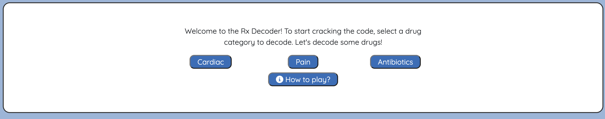
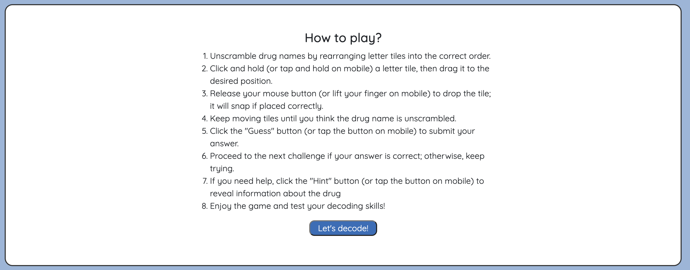
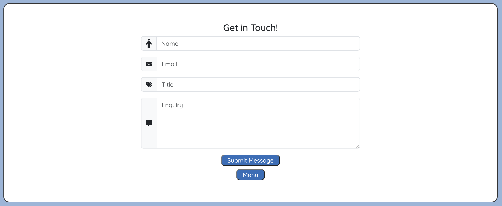
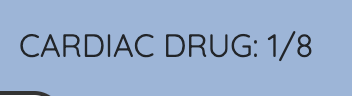

# [RX DECODER](https://mikavir.github.io/rx-decoder)

[](https://github.com/mikavir/rx-decoder/commits/main)
[](https://github.com/mikavir/rx-decoder/commits/main)
[](https://github.com/mikavir/rx-decoder)

🛑🛑🛑🛑🛑🛑🛑🛑🛑START OF NOTES (to be deleted)

GitHub now supports CALLOUTS in Markdown files.
There are some callouts already embedded in this application for you.
However, if you feel that you want to add more, there are certain ones you can use.

NOTE: the preview for callouts isn't yet supported in Gitpod/Codeanywhere/VSCode/etc.
You'll have to commit/push the changes to GitHub to see it in action.

> [!NOTE]  
> BLUE: Highlights information that users should take into account, even when skimming.

> [!TIP]
> GREEN: Optional information to help a user be more successful.

> [!IMPORTANT]  
> PURPLE: Crucial information necessary for users to succeed.

> [!WARNING]  
> YELLOW: Critical content demanding immediate user attention due to potential risks.

> [!CAUTION]
> RED: Negative potential consequences of an action.

Source: https://github.com/orgs/community/discussions/16925

🛑🛑🛑🛑🛑🛑🛑🛑🛑🛑-END OF NOTES (to be deleted)

*Please see the responsiveness using [Am I Responsive](https://ui.dev/amiresponsive?url=http://mikavir.github.io/rx-decoder)*


**Rx Decoder:** Unlock the *Formula*, Master the *Cure*!

A responsive interactive game that can be used in a range of devices. It is aimed for medical professionals to test their expertise in drug names by making them guess the name of the drug with helpful drug actions.


## UX


### Colour Scheme

After researching healthcare web applications, I've discovered that specific colors are recommended for use. Among them, blue stands out as particularly advantageous due to its ability to evoke feelings of trust and security. Incorporating the color blue into the design can foster associations with medical professionalism, enhancing user confidence and comfort. Additionally, I've examined medical websites like [BMJ](https://www.bmj.com/) and the [NHS](https://www.nhs.uk/), drawing inspiration from their use of blue hues. This analysis has helped me determine the most suitable shade of blue to incorporate into the web application's design, aligning it with established standards and user expectations within the healthcare field.

- `#333` used for primary text.
- `#2a6ebb` used for primary highlights.

I used [coolors.co](https://coolors.co/2a6ebb-97b6da-ffffff-333333) to generate my colour palette.


These colors serve as visual cues for user feedback on their answers: green signifies correctness, while red indicates an incorrect response.

I have used [coolors.co](https://coolors.co/007f3b-ff0000) to generate these colours.


### Typography

Based on research from the [Print Authority](https://theprintauthority.com/best-fonts-for-medical-printed-materials/), I've identified fonts commonly utilized in healthcare-related writing or web applications. One prominent example is QuickSands, which stands out due to its rounded terminals, enhancing readability. Opting for a font traditionally employed in healthcare communication fosters a sense of familiarity within the medical community. By leveraging such fonts, this game aims to resonate more effectively with its target audience, primarily medical professionals. 

- [Quicksands](https://fonts.google.com/specimen/Quicksand) was used for all text.

- [Font Awesome](https://fontawesome.com) icons were used throughout the site, such as the social media icons in the footer and the buttons.


## User Stories


### New Site Users

- As a new game user, I would like to see a memorable logo, so that I can remember the game.
- As a new game user, I would like to see instructions, so that I can know how to play the game.
- As a new game user, I would like to see a contact information, so that I can email when I have questions.
- As a new game user, I would like to have hints, so that I can easily play the game.
- As a new game user, I would like to be able to easily quit the game, so that I can stop playing the game as desired.

### Returning Site Users

- As a returning game user, I would like to have different categories, so that I can challenge myself more.
- As a returning game user, I would like to have a log of my scores, so that I can remember how well I did.
- As a returning game user, I would like to see contact information, so that I can contact the developer if I encounter any bugs.


## Wireframes

To follow best practice, wireframes were developed for mobile, tablet, and desktop sizes.
I've used [Balsamiq](https://balsamiq.com/wireframes) to design my site wireframes.

### Mobile Wireframes

<details>
<summary> Click here to see the Mobile Wireframes </summary>

Menu
  - 

Game
  - 

Results
  - 

Contact
  - 


</details>

### Tablet Wireframes

<details>
<summary> Click here to see the Tablet Wireframes </summary>

Menu
  - 

Game
  - 

Results
  - 

Contact
  - 

</details>

### Desktop Wireframes

<details>
<summary> Click here to see the Desktop Wireframes </summary>

Menu
  - 

Game
  - 

Results
  - 

Contact
  - 

</details>

## Features

### Existing Features

- **Logo**

    - Incorporating a logo into the game design can offer a powerful visual symbol that resonates with users, fostering a memorable connection to the game. By utilizing a logo with a color scheme harmonious with the game's aesthetic, coherence is maintained, providing users with a consistent and cohesive experience. This approach not only aims to appeal to the intended audience of medical professionals by presenting a clinical image but also contributes to establishing a unique identity for the game itself.


- **Start Modal**

    - The start modal serves as the initial display of the game, presenting a clear layout of its mechanics. Users are prompted to begin gameplay by selecting one of the categorized buttons, while also having the option to access instructions through a dedicated button. It sets expectations by communications the goals and rewards of the game.



- **"How to Play" Modal**

    - The "How to Play" modal provides clear instructions on the rules and gameplay mechanics, ensuring that players understand how to play the game correctly and avoid confusion or frustration. It helps newcomers understand the game mechanics of the drag and drop, and objectives quickly and efficiently, reducing the learning curve and enhancing their overall gaming experience.



- **"Contact" button**

    - A contact button that's easy to find in the game helps players access help when they need it. Putting it in a visible spot shows that the game cares about its players and can boost its reputation.


- **"Contact" Modal**

    - The implentation of contact modal in a game allows players to easily get help and report issues, improving their experience. It encourages players to engage with developers and ensures accessibility for all. This is beneficial for the developer as they can receive feedback on the game. When user have filled the contact form, they will receive a auto-reply email for confirmation that their form had submitted. Otherwise, error messages will appear.



- **"Go Back to Game" Button**

    - Including a "Go Back to Game" button on the contact screen enables users to return to their game session seamlessly. This feature instills confidence in users when reporting bugs or issues, as they know they can easily resume their gameplay afterward.
    


- **"Hint" Button and Section**

    - Implementing a "Hint Button" enables players to receive assistance when they're stuck, reducing frustration and improving their chances of completing the game. The hints, which outline drug actions, aid medical professionals in identifying unfamiliar medications and offer a learning opportunity for those unfamiliar with drug actions.
    


- **"Exit Game" Button**

    - The "Exit Game" button will allow users to quit the game. Its presence will improve user experience as it will allow users to control their gaming sessions and choose when to end them, enhancing their overall satisfaction and autonomy. Having a clearly labeled exit button helps prevent player frustration by eliminating the need for complex or time-consuming steps to exit the game.
    


- **Lives and Dissapearing Hearts Animation**

    - The game features five lives represented by hearts. When a mistake is made while guessing the word, the user loses a life, and a heart vanishes using jQuery animation. The limited number of lives adds a sense of challenge and excitement, prompting players to strategize and persevere to advance in the game. Conserving lives and conquering challenging drug names enhances the gaming experience, making their wins feel more rewarding.


- **Progress Tracker**

    - The game incorporates a progress tracker, indicating both the number of drugs guessed and those remaining, aiding users in tracking their progress and setting goals to decipher the remaining drug names. Moreover, the displayed drug titles adapt based on the chosen category, for instance, displaying "cardiac drug" if the cardiac category is selected.



- **Game Over Modal**

    -This modal appears when the user quits or loses the game. It showcases a confetti of emojis, generated through [js-confetti](https://www.npmjs.com/package/js-confetti), tailored to the situation. When the user quits, a "crying emoji" 😭 is displayed, while losing lives prompts a "skull and crossbones" ☠️. This feature provides visual feedback to enhance user engagement and also highlights the drug names guessed by the user, recognizing their achievements. 

    -The messages in the game over modal also differs in depending on the number of words that the user have guessed.
    
    *No words guessed* :
    "Boohoo! You have guessed none of the drugs. Time to read the British National Formulary (BNF)"

    *1 words guessed* : 
    "Well done! You have guessed a drug. Read theBritish National Formulary (BNF) to learn more drugs"

    *More than 1 word* :
    "Well Done! You have guessed (*number of drugs*) drugs. Call yourself a master of drugs"


- **Won Game modal**

    - When the user successfully guesses all the drug names, the "Won Game" modal appears, accompanied by a confetti of emojis resembling pills 💊 using [js-confetti](https://www.npmjs.com/package/js-confetti). This modal serves to recognize the user's achievement and celebrate their success. It includes a call-to-action prompting users to try another category, encouraging them to stay engaged with the game.


- **Play Again Button**

    - The "Play Again" button enables users to replay the game by reloading the page back to the "Start Modal". Conveniently placed within both the "Game Over" and "Won Game" modals, it encourages users to engage in another round of gameplay.
    


- **Drag and Drop Game Area**

    - The use of "Drag and Drop" mechanics encourages accesibility as it is easy to understand increasing to wider target audience. 
    


- **Animation with Incorrect Guess**

    - When the user makes an incorrect guess of the drug name, the box turns red. This provides visual feedback to the user, aiding in understanding and learning from their mistakes.
    


- **Animation with Correct Guess**

    - When the user makes a correct guess of the drug name, the box turns green, providing visual feedback to acknowledge their achievement. This helps users track their progress and feel rewarded for their success.
    


### Future Features

- Leaderboards
    - Due to the limited number of drug names available in this game, implementing a leaderboard was deemed inappropriate since the same number of winners would always emerge. However, with an increased pool of drug names to win, introducing a leaderboard would become a desirable feature, allowing for competition among players and adding depth to the gaming experience.

## Development Story

This section will outline the development process of the game. The objective is for users to guess the shuffled drug name. To aid users in progressing during challenging moments, hints will be provided. I will organize this section into distinct features that I have established for the game.

- **Making the box for letter containers**
In vision, I wanted to have a box per letter of the drug name. That box should have a data-set of the letter for me to use it in the logic. I have manage to implement this by making a function that will loop over the drugName word and creating a div per letter and appending it to the DOM. A similar approach was taken when implementing the letter containers for users guessed word.
```js
function addBox(word) {
  for (let letter of word) {
      let letterPerBox = document.createElement('div');
      letterPerBox.className = "letter-box letter-container";
      letterPerBox.dataset.letter = letter; // https://blog.webdevsimplified.com/2020-10/javascript-data-attributes/
      document.getElementById("game-area").appendChild(letterPerBox);
  }
}
```
- **Shuffling the word**
In order the shuffle the letters inside the word, I have research on how to shuffle an array as a word is an array of characters. I have initially adopted the Fisher-Yates algorithm explained by [FreeCodeCamp](https://www.freecodecamp.org/news/how-to-shuffle-an-array-of-items-using-javascript-or-typescript/) as shown below.

  ```js
  function shuffleArray(arr) {
      for(let i = arr.length - 1; i > 0; i--) {
          const j = Math.floor(Math.random() * (i+1));
          [arr[i], arr[j]] = [arr[j], arr[i]];
          console.log(`${arr[i]} is swapped with ${arr[j]}`);
      }
      console.log(arr);
      return arr;
  }
  ```
However, with this function, the word was still not changing despite the console logs of the iterations shows the letter swapping. This can be seen below: 


This have made reconsider my function as the word was not immutable. I have found a solution in [StackOverflow](https://stackoverflow.com/questions/3943772/how-do-i-shuffle-the-characters-in-a-string-in-javascript) and was inspired by it to make this new function:

  ```js
    function shuffleWord(word) {
      let shuffledWord = '';
      word = word.split('');
      while (word.length > 0) {
          shuffledWord += word.splice(Math.floor(word.length * Math.random()), 1);
      }
      return shuffledWord;
    }
  ```
This function involves creating a new array and splitting the word array into substrings. The "while" liip will then make the shuffled word with the randomised returned letter of the words.splice(). The function itself will then return the shuffled word.

- **Drag and Drop**
As I have wanted to create a drag and drop mechanics. I have researched on how to create this mechanism. Using [Jquery UI](https://jqueryui.com/) [draggables](https://jqueryui.com/draggable/) and [droppable](https://api.jqueryui.com/droppable/), I was able to achieve this. I did encounter issues with the appending of "draggable letters" to the "letter containers" due to the default styling and behaviours of JQuery UI as shown in the below screenshot:


In order to fix this, I had to override the default styling of jquery ui with jquery: 

  ```js
  $('.draggableLetters').css({
          'left': '0px',

      });
  ```


## Tools & Technologies Used

- [](https://git-scm.com) used for version control. (`git add`, `git commit`, `git push`)
- [](https://github.com) used for secure online code storage.
- [](https://gitpod.io) used as a cloud-based IDE for development.
- [](https://en.wikipedia.org/wiki/HTML) used for the main site content.
- [](https://en.wikipedia.org/wiki/CSS) used for the main site design and layout.
- [](https://www.javascript.com) used for user interaction on the site.
- [](https://pages.github.com) used for hosting the deployed front-end site.
- [](https://getbootstrap.com) used as the front-end CSS framework for modern responsiveness and pre-built components.
- [](https://jquery.com) used for user interaction on the site.
- [jQuery User Interface](https://jqueryui.com/) used for JavaScript library to easily manipulate the Document Object Model (DOM) and manipulate the drag and drop mechanism.
- [jQuery UI Touch Punch](https://www.npmjs.com/package/jquery-ui-touch-punch) used to allow touch events use for jQuery UI widgets.
- [](https://balsamiq.com/wireframes) used for creating wireframes.
- [js-confetti](https://www.npmjs.com/package/js-confetti) used to create confettis for animation.
- [Jest](https://jestjs.io/) used for JavaScript testing.
- [Font Awesome](https://fontawesome.com/) used for icons all throughout the game.

## Testing

> [!NOTE]  
> For all testing, please refer to the [TESTING.md](TESTING.md) file.

## Deployment

The site was deployed to GitHub Pages. The steps to deploy are as follows:

- In the [GitHub repository](https://github.com/mikavir/rx-decoder), navigate to the Settings tab 
- From the source section drop-down menu, select the **Main** Branch, then click "Save".
- The page will be automatically refreshed with a detailed ribbon display to indicate the successful deployment.

The live link can be found [here](https://mikavir.github.io/rx-decoder)

### Local Deployment

This project can be cloned or forked in order to make a local copy on your own system.

#### Cloning

You can clone the repository by following these steps:

1. Go to the [GitHub repository](https://github.com/mikavir/rx-decoder) 
2. Locate the Code button above the list of files and click it 
3. Select if you prefer to clone using HTTPS, SSH, or GitHub CLI and click the copy button to copy the URL to your clipboard
4. Open Git Bash or Terminal
5. Change the current working directory to the one where you want the cloned directory
6. In your IDE Terminal, type the following command to clone my repository:
	- `git clone https://github.com/mikavir/rx-decoder.git`
7. Press Enter to create your local clone.

Alternatively, if using Gitpod, you can click below to create your own workspace using this repository.

[](https://gitpod.io/#https://github.com/mikavir/rx-decoder)

Please note that in order to directly open the project in Gitpod, you need to have the browser extension installed.
A tutorial on how to do that can be found [here](https://www.gitpod.io/docs/configure/user-settings/browser-extension).

#### Forking

By forking the GitHub Repository, we make a copy of the original repository on our GitHub account to view and/or make changes without affecting the original owner's repository.
You can fork this repository by using the following steps:

1. Log in to GitHub and locate the [GitHub Repository](https://github.com/mikavir/rx-decoder)
2. At the top of the Repository (not top of page) just above the "Settings" Button on the menu, locate the "Fork" Button.
3. Once clicked, you should now have a copy of the original repository in your own GitHub account!

### Local VS Deployment

There are no differences between local and deployment. 

## Credits

### Content

| Source | Location | Notes |
| --- | --- | --- |
| [Markdown Builder](https://tim.2bn.dev/markdown-builder) | README and TESTING | tool to help generate the Markdown files |
| [Team Tree House](https://teamtreehouse.com/community/any-one-know-how-to-make-a-restart-button) | game.js: (playAgain()) | How to reset game by reloading window |
| [Bootstrap](https://getbootstrap.com/docs/5.0/getting-started/introduction/) | index.html | Responsiveness of the game and adding pre-built classes |
| [Stack Overflow](https://stackoverflow.com/questions/3955229/remove-all-child-elements-of-a-dom-node-in-javascript ) | game.js: (nextWord()) | How to remove all child elements |
| [MDN Web Docs](https://developer.mozilla.org/en-US/docs/Web/API/setTimeout) | game.js: main function | Delay animation and next word function |
| [W3 Schools](https://www.w3schools.com/js/tryit.asp?filename=tryjs_array_remove) | game.js: getRandomDrug() | How to remove an element from an array using splice() |
| [W3 Schools](https://www.w3schools.com/js/js_validation.asp)  | email.js: validateForm() | How to retrieve elements from form for validating |
| [Stack Overflow](https://stackoverflow.com/questions/35536562/how-to-make-drag-and-drop-jquery)  | game.js : dragAndDrop() | How to make drag and drop jquery |
| [JQuery UI](https://api.jqueryui.com/draggable/)  | game.js : dragAndDrop() | draggable widget and methods |
| [JQuery UI](https://api.jqueryui.com/droppable/)  | game.js : dragAndDrop() | droppable widget and methods |


### Media


| Source | Location | Type | Notes |
| --- | --- | --- | --- |
| [Canva](https://www.canva.com/) | index.html | logo | generated logo for game |
| [FontIcon](https://gauger.io/fonticon/) | index.html | favicon | generated favicon for game |


### Acknowledgements


- I would like to thank my Code Institute mentor, [Tim Nelson](https://github.com/TravelTimN) for his support throughout the development of this project.
- I would like to thank the [Code Institute](https://codeinstitute.net) tutor team for their assistance with troubleshooting and debugging some project issues.
- I would like to thank the [Code Institute Slack community](https://code-institute-room.slack.com) for the moral support; it kept me going during periods of self doubt and imposter syndrome.
- I would like to thank my partner (John/Jane), for believing in me, and allowing me to make this transition into software development.
- I would like to thank my employer, for supporting me in my career development change towards becoming a software developer.
