# [RX DECODER](https://mikavir.github.io/rx-decoder)

🛑🛑🛑🛑🛑🛑🛑🛑🛑START OF NOTES (to be deleted)

GitHub now supports CALLOUTS in Markdown files.
There are some callouts already embedded in this application for you.
However, if you feel that you want to add more, there are certain ones you can use.

NOTE: the preview for callouts isn't yet supported in Gitpod/Codeanywhere/VSCode/etc.
You'll have to commit/push the changes to GitHub to see it in action.

> [!NOTE]  
> BLUE: Highlights information that users should take into account, even when skimming.

> [!TIP]
> GREEN: Optional information to help a user be more successful.

> [!IMPORTANT]  
> PURPLE: Crucial information necessary for users to succeed.

> [!WARNING]  
> YELLOW: Critical content demanding immediate user attention due to potential risks.

> [!CAUTION]
> RED: Negative potential consequences of an action.

Source: https://github.com/orgs/community/discussions/16925

🛑🛑🛑🛑🛑🛑🛑🛑🛑🛑-END OF NOTES (to be deleted)
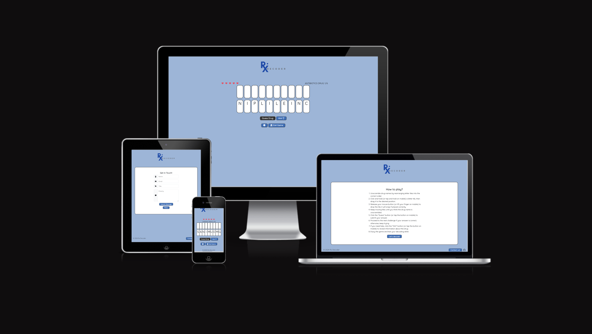
*Please see the responsiveness using [Am I Responsive](https://ui.dev/amiresponsive?url=http://mikavir.github.io/rx-decoder)*

**Rx Decoder:** Unlock the *Formula*, Master the *Cure*!

A responsive interactive game that can be used in a range of devices. It is aimed for medical professionals to test their expertise in drug names by making them guess the name of the drug with helpful drug actions.

## UX

### Colour Scheme

After researching healthcare web applications, I've discovered that specific colors are recommended for use. Among them, blue stands out as particularly advantageous due to its ability to evoke feelings of trust and security. Incorporating the color blue into the design can foster associations with medical professionalism, enhancing user confidence and comfort. Additionally, I've examined medical websites like [BMJ](https://www.bmj.com/) and the [NHS](https://www.nhs.uk/), drawing inspiration from their use of blue hues. This analysis has helped me determine the most suitable shade of blue to incorporate into the web application's design, aligning it with established standards and user expectations within the healthcare field.

- `#333` used for primary text.
- `#2a6ebb` used for primary highlights.

I used [coolors.co](https://coolors.co/2a6ebb-97b6da-ffffff-333333) to generate my colour palette.

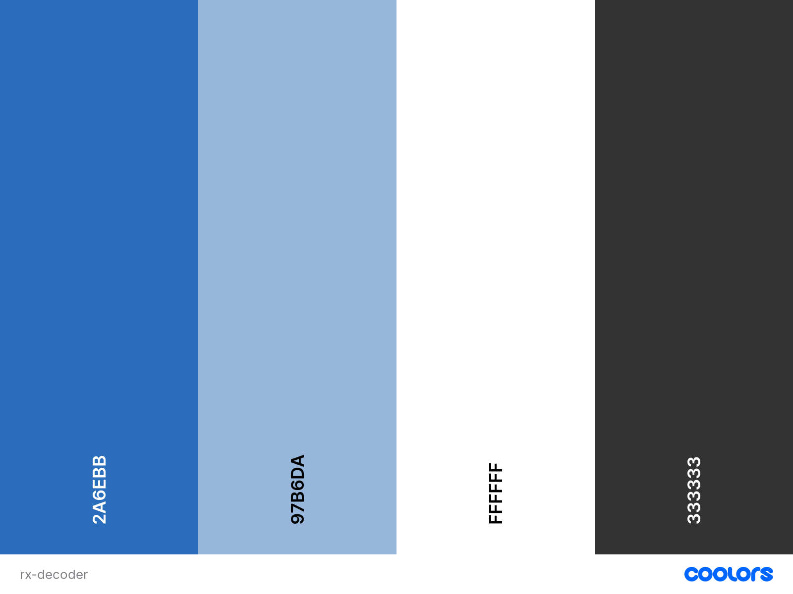

These colors serve as visual cues for user feedback on their answers: green signifies correctness, while red indicates an incorrect response.

I have used [coolors.co](https://coolors.co/007f3b-ff0000) to generate these colours.

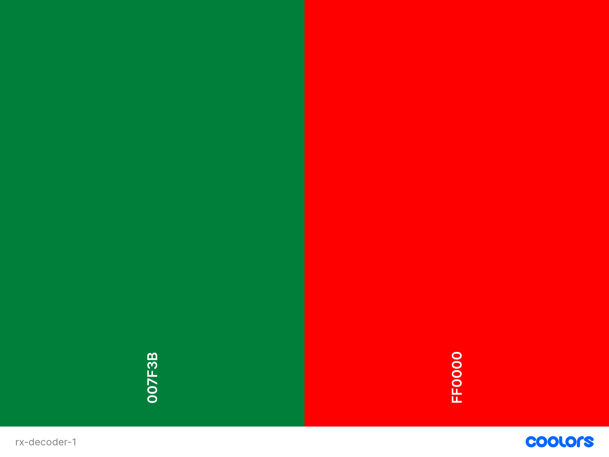

### Typography

Based on research from the [Print Authority](https://theprintauthority.com/best-fonts-for-medical-printed-materials/), I've identified fonts commonly utilized in healthcare-related writing or web applications. One prominent example is QuickSands, which stands out due to its rounded terminals, enhancing readability. Opting for a font traditionally employed in healthcare communication fosters a sense of familiarity within the medical community. By leveraging such fonts, this game aims to resonate more effectively with its target audience, primarily medical professionals. 

- [Quicksands](https://fonts.google.com/specimen/Quicksand) was used for all text.

- [Font Awesome](https://fontawesome.com) icons were used throughout the site, such as the social media icons in the footer and the buttons.

## User Stories

### New Site Users

- As a new game user, I would like to see a memorable logo, so that I can remember the game.
- As a new game user, I would like to see instructions, so that I can know how to play the game.
- As a new game user, I would like to see a contact information, so that I can email when I have questions.
- As a new game user, I would like to have hints, so that I can easily play the game.
- As a new game user, I would like to be able to easily quit the game, so that I can stop playing the game as desired.

### Returning Site Users

- As a returning game user, I would like to have different categories, so that I can challenge myself more.
- As a returning game user, I would like to have a log of my scores, so that I can remember how well I did.
- As a returning game user, I would like to see contact information, so that I can contact the developer if I encounter any bugs.

## Wireframes

To follow best practice, wireframes were developed for mobile, tablet, and desktop sizes.
I've used [Balsamiq](https://balsamiq.com/wireframes) to design my site wireframes.

### Mobile Wireframes

 Click here to see the Mobile Wireframes 

Menu
  - 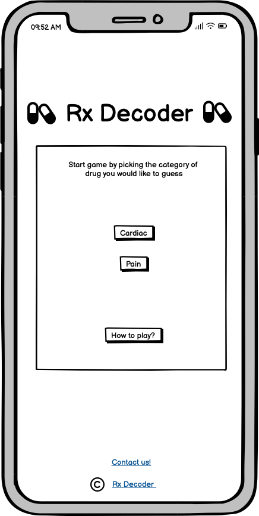

Game
  - 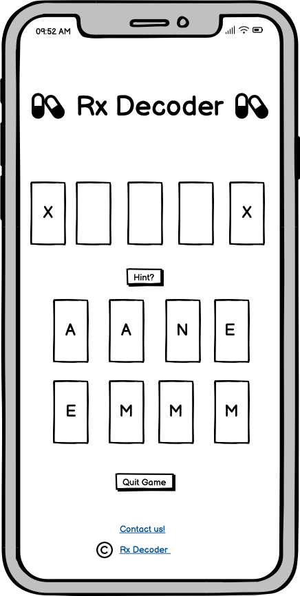

Results
  - 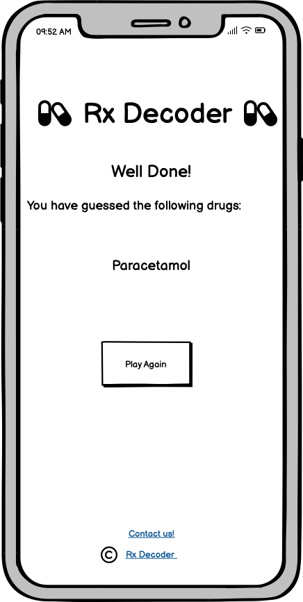

Contact
  - 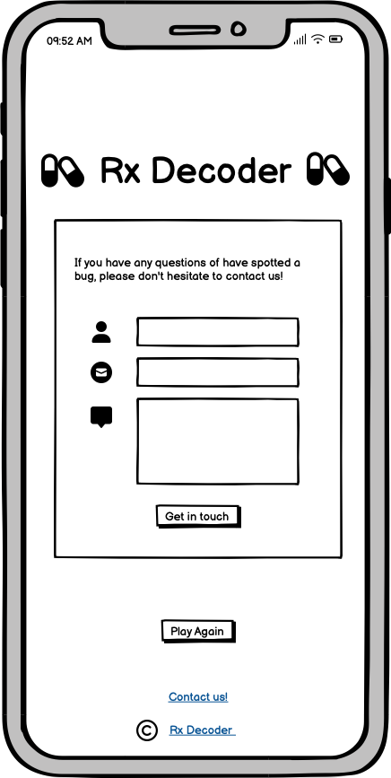

### Tablet Wireframes

 Click here to see the Tablet Wireframes 

Menu
  - 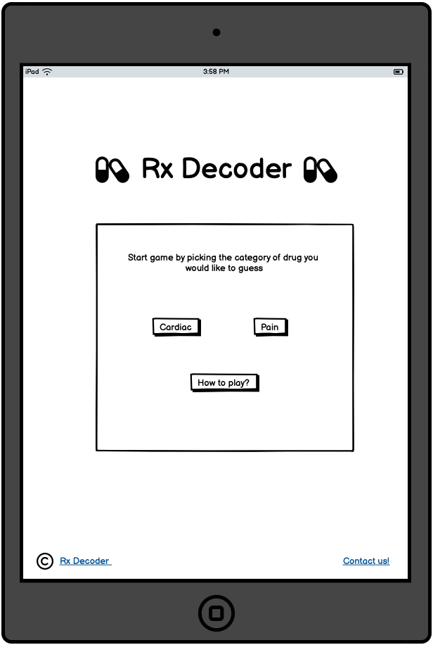

Game
  - 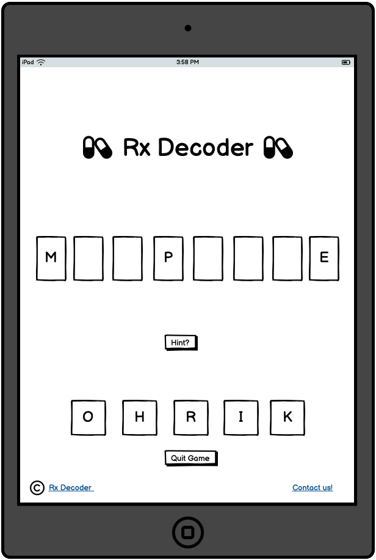

Results
  - 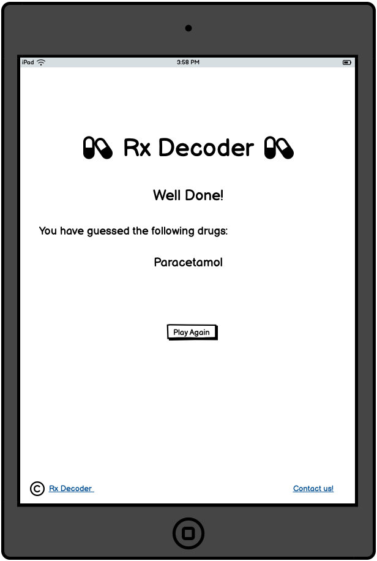

Contact
  - 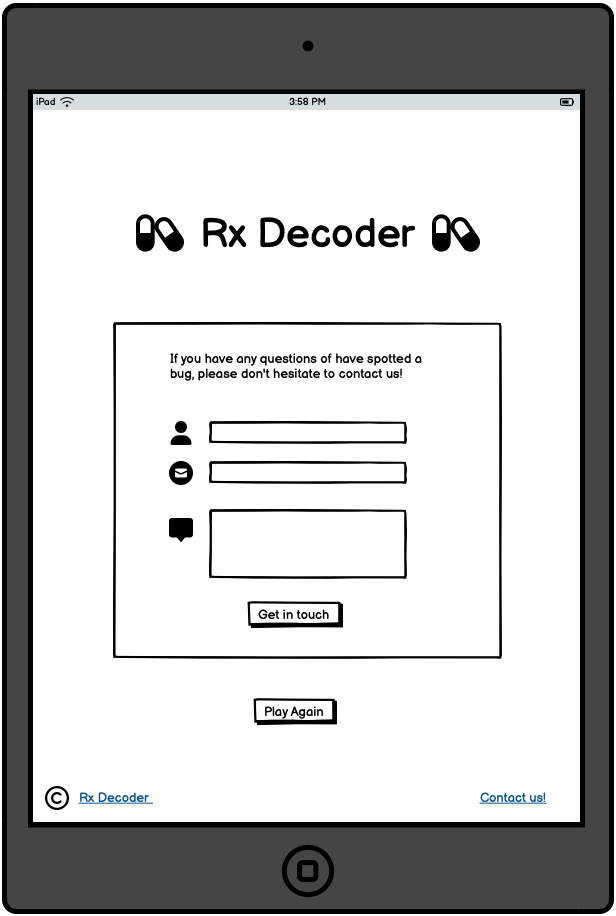

### Desktop Wireframes

 Click here to see the Desktop Wireframes 

Menu
  - 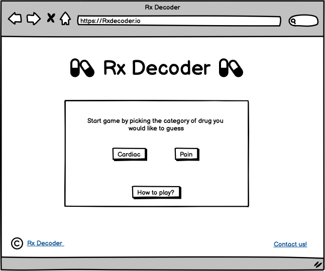

Game
  - 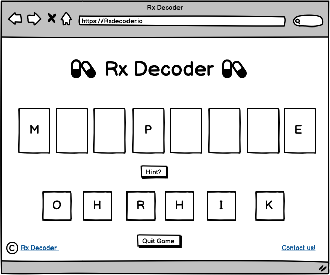

Results
  - 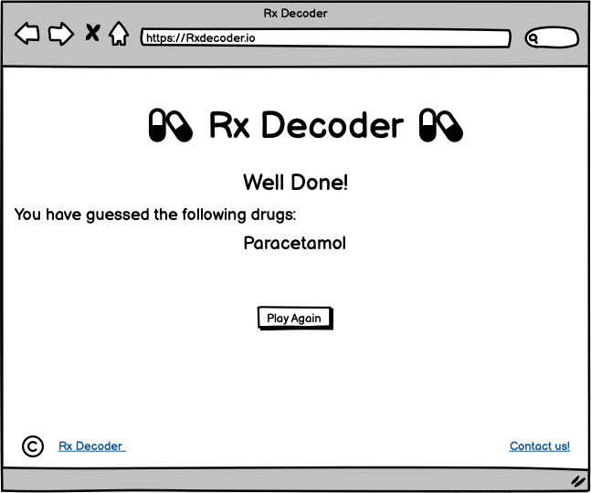

Contact
  - 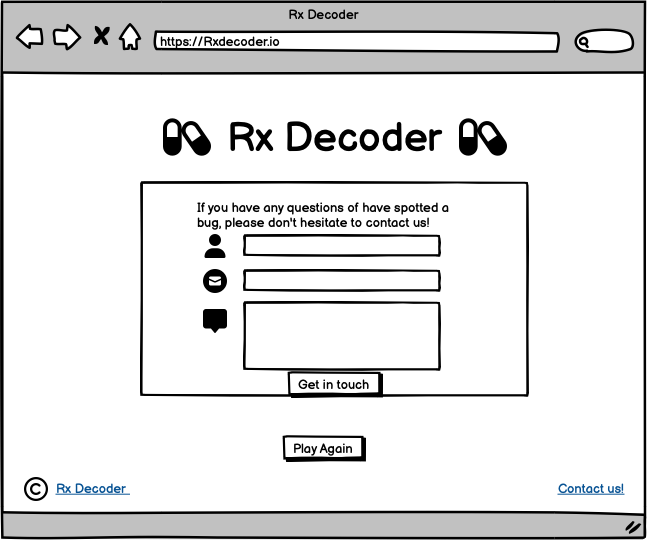

## Features

🛑🛑🛑🛑🛑🛑🛑🛑🛑🛑 START OF NOTES (to be deleted)

In this section, you should go over the different parts of your project,
and describe each in a sentence or so.

You will need to explain what value each of the features provides for the user,
focusing on who this website is for, what it is that they want to achieve,
and how your project is the best way to help them achieve these things.

For some/all of your features, you may choose to reference the specific project files that implement them.

IMPORTANT: Remember to always include a screenshot of each individual feature!

🛑🛑🛑🛑🛑🛑🛑🛑🛑🛑-END OF NOTES (to be deleted)

### Existing Features

- **Logo**

    - Incorporating a logo into the game design can offer a powerful visual symbol that resonates with users, fostering a memorable connection to the game. By utilizing a logo with a color scheme harmonious with the game's aesthetic, coherence is maintained, providing users with a consistent and cohesive experience. This approach not only aims to appeal to the intended audience of medical professionals by presenting a clinical image but also contributes to establishing a unique identity for the game itself.

- **{{ YOUR-TITLE-FOR-FEATURE-#2 }}**

    - Details about this particular feature, including the value to the site, and benefit for the user. Be as detailed as possible!

- **{{ YOUR-TITLE-FOR-FEATURE-#3 }}**

    - Details about this particular feature, including the value to the site, and benefit for the user. Be as detailed as possible!

🛑🛑🛑🛑🛑🛑🛑🛑🛑🛑 START OF NOTES (to be deleted)

Repeat as necessary for as many features as your site contains.

Hint: the more, the merrier!

🛑🛑🛑🛑🛑🛑🛑🛑🛑🛑-END OF NOTES (to be deleted)

### Future Features

🛑🛑🛑🛑🛑🛑🛑🛑🛑🛑 START OF NOTES (to be deleted)

Do you have additional ideas that you'd like to include on your project in the future?
Fantastic! List them here!
It's always great to have plans for future improvements!
Consider adding any helpful links or notes to help remind you in the future, if you revisit the project in a couple years.

🛑🛑🛑🛑🛑🛑🛑🛑🛑🛑-END OF NOTES (to be deleted)

- {{ YOUR-TITLE-FOR-FUTURE-FEATURE-#1 }}
    - Any additional notes about this feature.
- {{ YOUR-TITLE-FOR-FUTURE-FEATURE-#2 }}
    - Any additional notes about this feature.
- {{ YOUR-TITLE-FOR-FUTURE-FEATURE-#3 }}
    - Any additional notes about this feature.

## Tools & Technologies Used

🛑🛑🛑🛑🛑🛑🛑🛑🛑🛑 START OF NOTES (to be deleted)

In this section, you should explain the various tools and technologies used to develop the project.
Make sure to put a link (where applicable) to the source, and explain what each was used for.
Some examples have been provided, but this is just a sample only, your project might've used others.
Feel free to delete any unused items below as necessary.

🛑🛑🛑🛑🛑🛑🛑🛑🛑🛑-END OF NOTES (to be deleted)

- ⚠️⚠️ REQUIRED <-- delete me ⚠️⚠️
-  used for version control. (`git add`, `git commit`, `git push`)
-  used for secure online code storage.
- ⚠️⚠️ CHOOSE ONLY ONE <-- delete me ⚠️⚠️
-  used as a cloud-based IDE for development.
-  used as a cloud-based IDE for development.
-  used as my local IDE for development.
- ⚠️⚠️ CHOOSE ALL APPLICABLE <-- delete me ⚠️⚠️
-  used for the main site content.
-  used for the main site design and layout.
-  used for user interaction on the site.
-  used as the back-end programming language.
- ⚠️⚠️ CHOOSE ONLY ONE <-- delete me ⚠️⚠️
-  used for hosting the deployed front-end site.
-  used for hosting the deployed back-end site.
- ⚠️⚠️ CHOOSE ONLY ONE (if applicable) <-- delete me ⚠️⚠️
-  used as the front-end CSS framework for modern responsiveness and pre-built components.
-  used as the front-end CSS framework for modern responsiveness and pre-built components.
- ⚠️⚠️ CHOOSE ALL APPLICABLE <-- delete me ⚠️⚠️
-  used as the Python framework for the site.
-  used as the non-relational database management with Flask.
-  used as the relational database management with Flask.
-  used as the Python framework for the site.
-  used as the relational database management.
-  used as the Postgres database from Code Institute.
-  used as the Postgres database.
-  used for online static file storage.
-  used for serving static files with Heroku.
-  used for online secure payments of ecommerce products/services.
-  used for online static file storage.

## Testing

> [!NOTE]  
> For all testing, please refer to the [TESTING.md](TESTING.md) file.

## Deployment

The site was deployed to GitHub Pages. The steps to deploy are as follows:

- In the [GitHub repository](https://github.com/mikavir/rx-decoder), navigate to the Settings tab 
- From the source section drop-down menu, select the **Main** Branch, then click "Save".
- The page will be automatically refreshed with a detailed ribbon display to indicate the successful deployment.

The live link can be found [here](https://mikavir.github.io/rx-decoder)

### Local Deployment

This project can be cloned or forked in order to make a local copy on your own system.

#### Cloning

You can clone the repository by following these steps:

1. Go to the [GitHub repository](https://github.com/mikavir/rx-decoder) 
2. Locate the Code button above the list of files and click it 
3. Select if you prefer to clone using HTTPS, SSH, or GitHub CLI and click the copy button to copy the URL to your clipboard
4. Open Git Bash or Terminal
5. Change the current working directory to the one where you want the cloned directory
6. In your IDE Terminal, type the following command to clone my repository:
	- `git clone https://github.com/mikavir/rx-decoder.git`
7. Press Enter to create your local clone.

Alternatively, if using Gitpod, you can click below to create your own workspace using this repository.

Please note that in order to directly open the project in Gitpod, you need to have the browser extension installed.
A tutorial on how to do that can be found [here](https://www.gitpod.io/docs/configure/user-settings/browser-extension).

#### Forking

By forking the GitHub Repository, we make a copy of the original repository on our GitHub account to view and/or make changes without affecting the original owner's repository.
You can fork this repository by using the following steps:

1. Log in to GitHub and locate the [GitHub Repository](https://github.com/mikavir/rx-decoder)
2. At the top of the Repository (not top of page) just above the "Settings" Button on the menu, locate the "Fork" Button.
3. Once clicked, you should now have a copy of the original repository in your own GitHub account!

### Local VS Deployment

🛑🛑🛑🛑🛑🛑🛑🛑🛑🛑-START OF NOTES (to be deleted)

Use this space to discuss any differences between the local version you've developed, and the live deployment site on GitHub Pages.

🛑🛑🛑🛑🛑🛑🛑🛑🛑🛑-END OF NOTES (to be deleted)

## Credits

🛑🛑🛑🛑🛑🛑🛑🛑🛑🛑-START OF NOTES (to be deleted)

In this section you need to reference where you got your content, media, and extra help from.
It is common practice to use code from other repositories and tutorials,
however, it is important to be very specific about these sources to avoid plagiarism.

🛑🛑🛑🛑🛑🛑🛑🛑🛑🛑-END OF NOTES (to be deleted)

### Content

🛑🛑🛑🛑🛑🛑🛑🛑🛑🛑-START OF NOTES (to be deleted)

Use this space to provide attribution links to any borrowed code snippets, elements, or resources.
A few examples have been provided below to give you some ideas.

Ideally, you should provide an actual link to every resource used, not just a generic link to the main site!

⚠️⚠️ EXAMPLE LINKS - REPLACE WITH YOUR OWN ⚠️⚠️

🛑🛑🛑🛑🛑🛑🛑🛑🛑🛑-END OF NOTES (to be deleted)

| Source | Location | Notes |
| --- | --- | --- |
| [Markdown Builder](https://tim.2bn.dev/markdown-builder) | README and TESTING | tool to help generate the Markdown files |
| [Chris Beams](https://chris.beams.io/posts/git-commit) | version control | "How to Write a Git Commit Message" |
| [W3Schools](https://www.w3schools.com/howto/howto_js_topnav_responsive.asp) | entire site | responsive HTML/CSS/JS navbar |
| [W3Schools](https://www.w3schools.com/howto/howto_css_modals.asp) | contact page | interactive pop-up (modal) |
| [W3Schools](https://www.w3schools.com/css/css3_variables.asp) | entire site | how to use CSS :root variables |
| [Flexbox Froggy](https://flexboxfroggy.com/) | entire site | modern responsive layouts |
| [Grid Garden](https://cssgridgarden.com) | entire site | modern responsive layouts |
| [StackOverflow](https://stackoverflow.com/a/2450976) | quiz page | Fisher-Yates/Knuth shuffle in JS |
| [YouTube](https://www.youtube.com/watch?v=YL1F4dCUlLc) | leaderboard | using `localStorage()` in JS for high scores |
| [YouTube](https://www.youtube.com/watch?v=u51Zjlnui4Y) | PP3 terminal | tutorial for adding color to the Python terminal |
| [strftime](https://strftime.org) | CRUD functionality | helpful tool to format date/time from string |
| [WhiteNoise](http://whitenoise.evans.io) | entire site | hosting static files on Heroku temporarily |

### Media

🛑🛑🛑🛑🛑🛑🛑🛑🛑🛑-START OF NOTES (to be deleted)

Use this space to provide attribution links to any images, videos, or audio files borrowed from online.
A few examples have been provided below to give you some ideas.

If you're the owner (or a close acquaintance) of all media files, then make sure to specify this.
Let the assessors know that you have explicit rights to use the media files within your project.

Ideally, you should provide an actual link to every media file used, not just a generic link to the main site!
The list below is by no means exhaustive. Within the Code Institute Slack community, you can find more "free media" links
by sending yourself the following command: `!freemedia`.

⚠️⚠️ EXAMPLE LINKS - REPLACE WITH YOUR OWN ⚠️⚠️

🛑🛑🛑🛑🛑🛑🛑🛑🛑🛑-END OF NOTES (to be deleted)

| Source | Location | Type | Notes |
| --- | --- | --- | --- |
| [Pexels](https://www.pexels.com) | entire site | image | favicon on all pages |
| [Lorem Picsum](https://picsum.photos) | home page | image | hero image background |
| [Unsplash](https://unsplash.com) | product page | image | sample of fake products |
| [Pixabay](https://pixabay.com) | gallery page | image | group of photos for gallery |
| [Wallhere](https://wallhere.com) | footer | image | background wallpaper image in the footer |
| [This Person Does Not Exist](https://thispersondoesnotexist.com) | testimonials | image | headshots of fake testimonial images |
| [Audio Micro](https://www.audiomicro.com/free-sound-effects) | game page | audio | free audio files to generate the game sounds |
| [Videvo](https://www.videvo.net/) | home page | video | background video on the hero section |
| [TinyPNG](https://tinypng.com) | entire site | image | tool for image compression |

### Acknowledgements

🛑🛑🛑🛑🛑🛑🛑🛑🛑🛑-START OF NOTES (to be deleted)

Use this space to provide attribution to any supports that helped, encouraged, or supported you throughout the development stages of this project.
A few examples have been provided below to give you some ideas.

⚠️⚠️ EXAMPLES ONLY - REPLACE WITH YOUR OWN ⚠️⚠️

🛑🛑🛑🛑🛑🛑🛑🛑🛑🛑-END OF NOTES (to be deleted)

- I would like to thank my Code Institute mentor, [Tim Nelson](https://github.com/TravelTimN) for his support throughout the development of this project.
- I would like to thank the [Code Institute](https://codeinstitute.net) tutor team for their assistance with troubleshooting and debugging some project issues.
- I would like to thank the [Code Institute Slack community](https://code-institute-room.slack.com) for the moral support; it kept me going during periods of self doubt and imposter syndrome.
- I would like to thank my partner (John/Jane), for believing in me, and allowing me to make this transition into software development.
- I would like to thank my employer, for supporting me in my career development change towards becoming a software developer.
