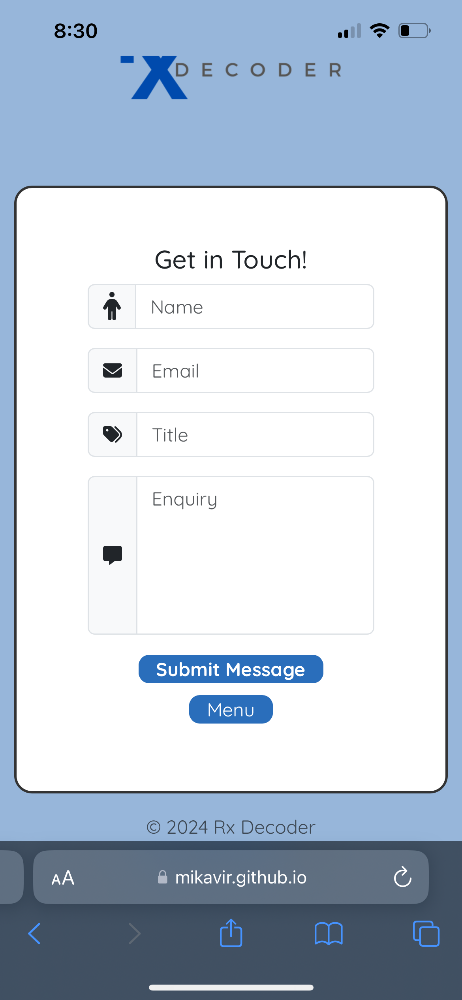
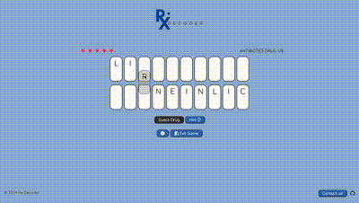

# Testing

> [!NOTE]  
> Return back to the [README.md](README.md) file.

## Code Validation
### HTML

I have used the recommended [HTML W3C Validator](https://validator.w3.org) to validate all of my HTML files.

| Validator| File | Screenshot | Notes |
| --- | --- | --- | --- |
|[W3C Validator](https://validator.w3.org/nu/?doc=https%3A%2F%2Fmikavir.github.io%2Frx-decoder%2F404.html)| 404.html |  | No errors found|
|[W3C Validator](https://validator.w3.org/nu/?doc=https%3A%2F%2Fmikavir.github.io%2Frx-decoder%2Findex.html)  | index.html |  | No errors found|

            
### CSS

I have used the recommended [CSS Jigsaw Validator](https://jigsaw.w3.org/css-validator) to validate all of my CSS files.

| Directory | File | Screenshot | Notes |
| --- | --- | --- | --- |
| assets | style.css |  | No error on style.css file, errors marked from the libraries used |

            
### JavaScript

I have used the recommended [JShint Validator](https://jshint.com) to validate all of my JS files.

| Directory | File | Screenshot | Notes |
| --- | --- | --- | --- |
| assets | email.js |  | Undefined variable of emailjs and unused variable of sendmail. This function was called in the index.html |
| assets | game.js |  | No warnings, undefined variables of module exports and js-confetti which is known and is external|
| assets | game.test.js |  | Undefined variables  of 'require' from jest |

            
## Browser Compatibility

I've tested my deployed project on multiple browsers to check for compatibility issues.

| Browser | Start Modal | In-Game | Instructions | Won Game | Game Over | Contact | 404 | Notes |
| --- | --- | --- | --- | --- | --- | --- | --- | --- |
| Chrome |  |  |  |  | |  |  | Works as expected |
| Firefox |  |  |  |  | |  |  | Works as expected |
| Safari |  |  |  |  | |  |  | Works as expected |


## Responsiveness

I've tested my deployed project on multiple devices to check for responsiveness issues.

| Device | Start Game | In-Game | Game Over | Won Game | Instructions | Contact | 404 | Notes |
| --- | --- | --- | --- | --- | --- | --- | --- | --- |
| Mobile (DevTools) (320px) |  |  |  |  |  |  |   | Works as expected |
| Tablet (DevTools) (768px) |  |  |  |  |  |  |   | Modals not centered due to the length |
| Desktop |  |  |  |  |  |  |   | Works as expected |
| Personal Mobile (iphone 13 pro) |  |  |  |  |  |  |   | Works as expected |


## Lighthouse Audit

I've tested my deployed project using the Lighthouse Audit tool to check for any major issues.

| Page | Mobile | Desktop | Notes |
| --- | --- | --- | --- |
| Index|  |  | Some minor warnings on accesibility |
|  404 |  |  | Some minor warnings on accesibility|


## Defensive Programming


Defensive programming was manually tested with the below user acceptance testing:

| Feature | Expectation | Test | Result | Fix | Screenshot |
| --- | --- | --- | --- | --- | --- |
| Start Modal | When a category button is clicked, game should start and start modal disapears | Tested the feature by clicking a button | The feature behaved as expected | Test concluded and passed |  |
| Contact Button | When user clicks the contact button in the middle of the game, user should be able to go back to the game when closing contact button | Tested the feature by clicking the contact button | The feature behaved as expected | Test concluded and passed |  |
| Guess Button | User can only submit when all the letter containers are filled and submit button will be green and clickable when the condition is true | Tested the feature by clicking submit without filling the containers and when a letter is removed from the letter containers when they are all filled, user is unable to submit | The feature behaved as expected | Test concluded and passed |  |
| Instruction Button | When clicked, instructions modal should be displayed and can be closed, and user can go back to the game | Tested the feature by clicking the button | The feature behaved as expected | Test concluded and passed |  |
| Hint button | When 'Hint' button is clicked, the hint section should appear below and the hint button is disabled | Tested the feature by clicking the hint button| The feature behaved as expected | Test concluded and passed |  |
| Exit Game Button | When the 'Exit Game' button is clicked, game area should disapear and the 'Game Over' modal appears with a confeti of "crying emoji" | Tested the feature by clicking the button | The feature behaved as expected | Test concluded and passed |  |
| Drag and Drop | Letter should not be able to be dropped with in a box that already has a letter | Tested by dropping letters into a already filled letter box | The letters were being stacked on top of each other | Fix: Add a conditional statement to be only droppable if the parent div (letter-container) has no children using the function `isEmpty()` | Unfixed:  Fixed: |
| Contact Form| | | | | | |
| Name Input | When submit button is clicked, user should be prompted for an empty name inputs | Tested the feature by submitting form without inputting name | The feature behaved as expected | Test concluded and passed |  |
| Name Input - Client Side Validation (if the `required` attribute was purposely removed) | When submit button is clicked, if the name input is empty. An error message should be displayed and the input border to turn red | Tested the feature by submitting form without inputting name | The feature behaved as expected | Test concluded and passed |  |
| Email Input | When submit button is clicked, user should be prompted for an empty email input | Tested the feature by submitting form without inputting email | The feature behaved as expected | Test concluded and passed |  |
| Email Input - Client Side Validation (if the `required` attribute was purposely removed) | When submit button is clicked, if the email input is empty. An error message should be displayed and the input border to turn red | Tested the feature by submitting form without inputting email | The feature behaved as expected | Test concluded and passed |  |
| Title Input | When submit button is clicked, user should be prompted for an empty title input | Tested the feature by submitting form without inputting title | The feature behaved as expected | Test concluded and passed |  |
| Title Input - Client Side Validation (if the `required` attribute was purposely removed) | When submit button is clicked, if the title input is empty. An error message should be displayed and the input border to turn red | Tested the feature by submitting form without inputting title | The title input border became red but no error message shown | Fixed `validateForm()` function by adding `emailFeedback.innerText`| Unfixed:  Fixed:  |
| Message Input | When submit button is clicked, user should be prompted for an empty message input | Tested the feature by submitting form without inputting a message | The feature behaved as expected | Test concluded and passed |  |
| Message Input - Client Side Validation (if the `required` attribute was purposely removed) | When submit button is clicked, if the message input is empty. An error message should be displayed and the input border to turn red | Tested the feature by submitting form without inputting message | The feature behaved as expected | Test concluded and passed |  |


## User Story Testing

| User Story | Screenshot |
| --- | --- |
| As a new game user, I would like to see a memorable logo, so that I can remember the game. |  |
| As a new game user, I would like to see instructions, so that I can know how to play the game. |  |
|  As a new game user, I would like to see a contact information, so that I can email when I have questions. |  |
|   As a new game user, I would like to have hints, so that I can easily play the game. |  |
|  As a new game user, I would like to be able to easily quit the game, so that I can stop playing the game as desired. |  |
| As a returning game user, I would like to have different categories, so that I can challenge myself more. |  |
| As a returning game user, I would like to have a log of the drug names that I scored, so that I can remember how well I did. |  |
| As a returning game user, I would like to see contact information, so that I can contact the developer if I encounter any bugs. |  |
| As a returning game user, I would like to be able to keep track on how many drug name I need to guess so that I can be motivated to finish the game. |  |
| As a game administrator, I should be able to make the game more challenging by incorporating lives, so that I can make the users enjoy playing the game. |  |
|As a game administrator, I would like to have a platform for users contact me, so that they can report when they have a bug. |  |
| As a game administrator, I would like the user to be able to go back to the game after contacting me, so that they can keep playing the game and improve their experience.|  |

## User Feedback
This game was tested by a registered nurse. I was given a feedback of that it was a fun and interactive game. However, there were a few typo in the drug names. This has been fixed since then.


## Automated Testing

I have conducted a series of automated tests on my application.

I fully acknowledge and understand that, in a real-world scenario, an extensive set of additional tests would be more comprehensive.

### JavaScript (Jest Testing)


I have used the [Jest](https://jestjs.io) JavaScript testing framework to test the application functionality.

In order to work with Jest, I first had to initialize NPM.

- `npm init`
- Hit `enter` for all options, except for **test command:**, just type `jest`.

Add Jest to a list called **Dev Dependencies** in a dev environment:

- `npm install --save-dev jest`

**IMPORTANT**: Initial configurations

When creating test files, the name of the file needs to be `file-name.test.js` in order for Jest to properly work.

Without the following, Jest won't properly run the tests:

- `npm install -D jest-environment-jsdom`

Due to a change in Jest's default configuration, you'll need to add the following code to the top of the `.test.js` file:

```js
/**
 * @jest-environment jsdom
 */

```

Make sure to include the name of all of your functions that are being tested in the `game.test.js` file.

```js
if (typeof module !== 'undefined') module.exports = {
    startGame,
    isGuessedWordCorrect,
    cardiacDictionary,
    painDictionary,
    getRandomDrug,
    shuffleWord,
    hasUserWonTheGame,
    word,
    hint,
    correctGuessedWord,
    canSubmit,
    livesLeft,
    livesTaken,
    noOfCorrectWords,
    gameIsOver,
    gameIsWon,
    gameIsExited,
    noOfDrugs,
};
```

Now that these steps have been undertaken, further tests can be written, and be expected to fail initially.
Write JS code that can get the tests to pass as part of the Red-Green refactor process.

Once ready, to run the tests, use this command:

- `npm test`

**NOTE**: To obtain a coverage report, use the following command:

- `npm test --coverage`

Below are the results from the tests that I've written for this application:

| Test Suites | Tests | Screenshot |
| --- | --- | --- |
| 1 passed | 18 passed |  |

#### Jest Test Issues

**JS confetti undefined**

Since [js-confetti](https://www.npmjs.com/package/js-confetti) was implemented using a CDN, Jest testing failed to recognize it, causing interruptions during testing.


- To fix this, I have searched online on "How to get jest to ignore a function". [CodeWithHugo](https://codewithhugo.com/jest-exclude-coverage/) explains that it can be done with an ignore line. Although, I understand that this should not be used all the time as all code should be tested. However, as `new JSConfetti()` is an external function, I found it appropriate for this case. Please see below my implementation: 

```js
function ignoreLine() {
    const jsConfetti = new JSConfetti();
    if (gameIsWon) {
        jsConfetti.addConfetti({
            emojis: ['💊'],
        });
    } else if (gameIsExited) {
        jsConfetti.addConfetti({
            emojis: ['😭'],
        });
    } else if (gameIsOver) {
        jsConfetti.addConfetti({
            emojis: ['☠️'],
        });
    } else {
        return;
    }
}
```

**JS hint Configuration**

The input of JSHint configuration into the game.test.js file resulted in errors, as it did not recognize the Jest environment. Below is the executed code and the error it threw: 

```
/* jshint esversion: 11, jquery: true */
/**
* @jest-environment jsdom
*/

```


- To fix this, I have changed the order of the lines: 

```js
/**
* @jest-environment jsdom
*/

/* jshint esversion: 11, jquery: true */
```

**Mocking The Index.html**
 
 When mocking the index.html, I ran into issues of where it was not recognising the email.js that I have implemented as an API. 

```js
beforeAll(() => {
let fs = require("fs");
let fileContents = fs.readFileSync("index.html", "utf-8");
document.open();
document.write(fileContents);
document.close();
});
```

Please see below the error: 


- To fix this, I've decided to discontinue mocking the index.html file because testing it became impractical due to numerous event handlers. Jest testing proved unsuitable for testing event handlers. Moving forward, I intend to explore alternative testing frameworks.

Overall, the majority of documentation on Jest testing pertains to the latest version, [Jest v29](https://jestjs.io/). However, troubleshooting became challenging for me as my project relied on Jest v26. While attempting to upgrade to Jest 29, I encountered difficulties due to changes in the syntax for mocking the DOM, and unfortunately, I couldn't find relevant documentation on this specific aspect. Therefore, I went back to Jest v26.

## Bugs


- `validateForm()` function was not returning an error message feedback to the user when title input was empty:

    

    - To fix this, I have added `.innertext` to the variable `emailFeedback` . Please see the implementation in the code block below:
    
    ```js
    emailFeedBack.innerText = "Please input a subject to your message";
    ```

- When user double clicks on the guess-button, this moves on the next word even without the letter containers not filled. The multiple clicks was not being handled well.

    

    - To fix this, I introduced an additional conditional statement within my guessButton event handler to ensure submission only occurs when the number of clicks (i.e., `e.detail`) equals 1. Additionally, I ensured that the guess button is `disabled`(`disabled` set to true) when `canSubmit` is false. This solution was inspired by insights from[StackOverflow](https://stackoverflow.com/questions/16715075/preventing-multiple-clicks-on-button). . Please find my implementation in the code block below:

    ```js

    let hasBeenClicked = e.detail === 1;
            if (canSubmit && hasBeenClicked) {
                // Please see more of the code in game.js
            }

    ```


## Unfixed Bugs

- When a user "double tap" on submit button, it skips a word on mobile devices. This occurance does not happen on chrome developer tools.

    

    - I have made several attempts to fix this and none have worked:

    - Making `dblclick` event false as advised by [StackOverflow](https://stackoverflow.com/questions/2424377/javascript-suppress-double-click-selection): 
    Result: No change.

    ```js
    $(guessButton).dblclick(function(){
    return false;
    });
    ```

    - Adding a class with `pointer-event: none` when `nextWord` is happening.
    Result: No change.

    ```css
    .noevents {
        pointer-events: none;
    }

    ```

    - Making a `touch-start` event handler:
    Result: No change.


    ```js
     guessButton.addEventListener("touch-start", (e) => {
            // https://stackoverflow.com/questions/16715075/preventing-multiple-clicks-on-button
            // Prevents multiple clicks
            let hasBeenClicked = e.detail === 1;
            if (canSubmit && hasBeenClicked) {
                let guessedWord = makeGuessedWord();
                if (isGuessedWordCorrect(word, guessedWord) === true) {
                    $(".letter-container").addClass('correct');
                    setTimeout(function () {
                        nextWord();
                        canSubmit = false;
                        addCorrectGuessedWords(gameType, noOfDrugs, word);
                        setUpGame(choice);
                        if (gameIsWon) {
                            wonGame();
                        }
                    }, 500);
                } else {
                    $(".letter-container").addClass('incorrect');
                    setTimeout(function () {
                        $(".letter-container").removeClass('incorrect');
                    }, 1000);
                    mistakeMade(livesLeft);
                    isGameOver(correctGuessedWord);
                }
            }
        });

    ```

    fter numerous attempts to address the issue and seeking solutions from various resources, I've concluded that the problem might be related to the behavior of event handles on mobile and touch screen devices.


### GitHub **Issues**

**Fixed Bugs**

[](https://github.com/mikavir/rx-decoder/issues?q=is%3Aissue+is%3Aclosed+label%3Abug)

All previously closed/fixed bugs can be tracked [here](https://github.com/mikavir/rx-decoder/issues?q=is%3Aissue+is%3Aclosed).